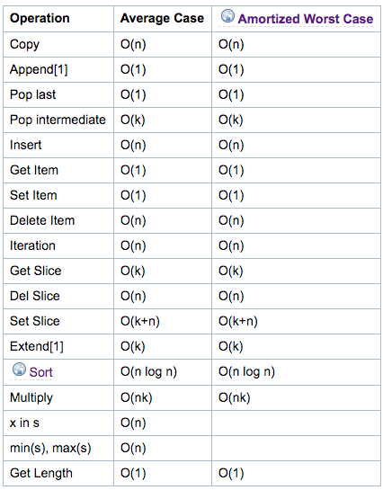

## Asymptotic Analysis
Asymptotic Analysis explains how the running time of an algorithm increases with the size of the input, in the limit, as the size of the input increases to infinity.  Order of magnitude is often called Big-O notation (for "order") and written as O(f(n)).     

Specifically, the time required to solve a problem depends on the number of steps it uses.  Growth functions are used to estimate the number of steps an algorithm uses as its input grows.  Worst-case complexity is the largest number of steps needed to solve the given problem.

Overall, the dominant term in the algorithm is the one used to compare different algorithms.

### Data Structure Operations
* 'n' is the number of elements currently in the container.
 'k' is either the value of a parameter or the number of elements in the parameter.

### List:
Internally, a list is represented as an array; the largest costs come from growing beyond the current allocation size (because everything must move), or from inserting or deleting somewhere near the beginning (because everything after that must move). If you need to add/remove at both ends, consider using a collections.deque instead.

 

### References
[1] - TimeComplexity, python.org, accessed 27 May 2020, https://wiki.python.org/moin/TimeComplexity
